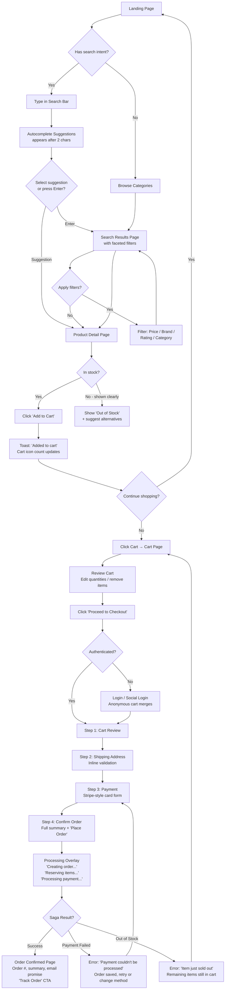
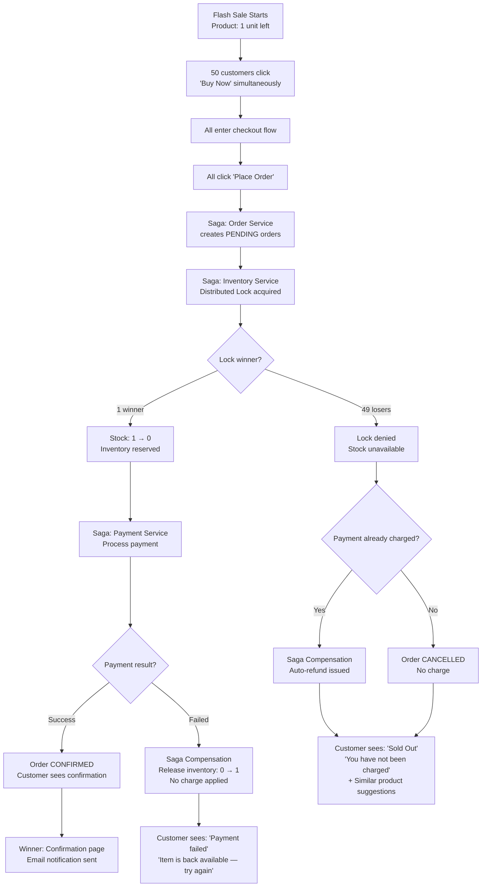
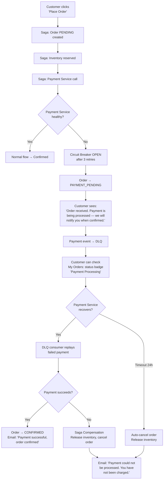
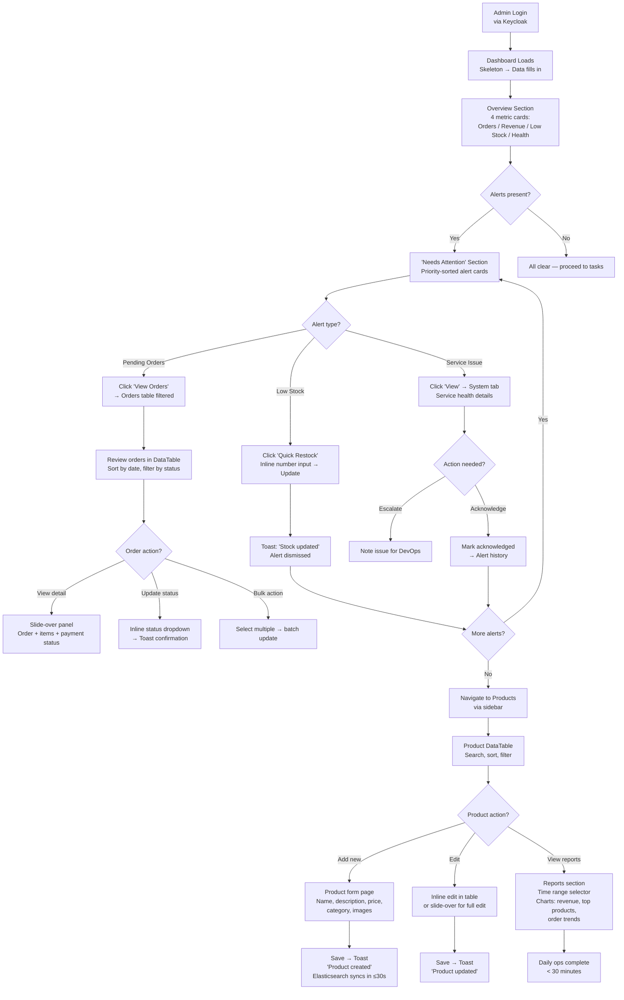
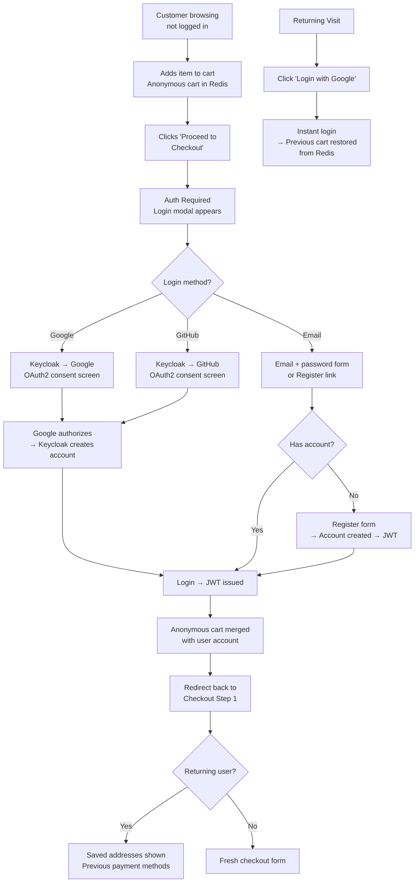
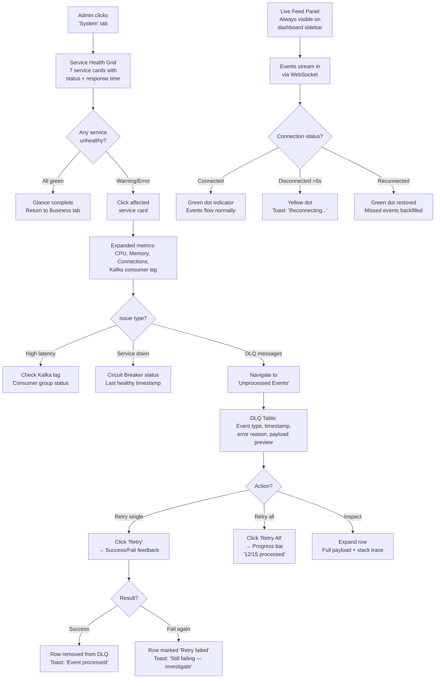

# UX Design Specification robo-mart

**Author:** Mark
**Date:** 2026-03-27

---

## Executive Summary

### Project Vision

RoboMart is a production-grade E-commerce platform serving as a comprehensive technical showcase for Senior Java Engineering competency. The UX design must support two distinct frontend applications — a Customer Website for product discovery and purchasing, and an Admin Dashboard for operations management — both built with Vue.js SPA architecture.

The design philosophy prioritizes functional clarity over pixel-perfection: every UI element should clearly demonstrate the distributed system patterns running beneath it. The UX serves dual purposes — providing a genuinely usable E-commerce experience while making backend capabilities visible and demonstrable in portfolio/interview contexts.

### Target Users

**Customer (Composite Persona):**

- Online shoppers (ages 25-42) with moderate tech literacy
- Core behavior: browse, search, cart, checkout, track orders
- Key need: trust signals, clear status communication, and reliable purchasing flow — even during backend failures
- Device: desktop browser primary (SPA)

**Empathy Snapshots:**
- *First-time user (Lan, 25)*: Anxious about trust — needs social proof (ratings, reviews), clear pricing, and reassurance at checkout. Will abandon on first error.
- *Bulk buyer (Hà, 42)*: Focused on accuracy — needs order summary confirmation, invoice-ready details, and confidence that 20 items are processed correctly. Expects recovery, not perfection.
- *Flash sale hunter (Minh, 35)*: Speed-driven — needs instant feedback on stock availability and purchase confirmation. Tolerates "sold out" if communicated immediately and fairly.

**Admin (Composite Persona):**

- Operations managers and DevOps/developers
- Core behavior: product CRUD, inventory management, order tracking, real-time monitoring, reporting
- Key need: data-dense interface with quick actions, real-time WebSocket updates, system health visibility
- Device: desktop browser (wide screen optimized)

**Empathy Snapshots:**
- *Ops manager (Tuấn, 30)*: Efficiency-driven — needs to complete daily tasks (restock, order review) in under 30 minutes. Overwhelmed by too many alerts. Needs prioritized, actionable information.
- *DevOps monitoring*: Diagnostic-driven — needs trace IDs, service status, and Kafka lag at a glance. Values precision over aesthetics.

### Key Design Challenges

1. **Dual-application UX with shared design system** — Two apps with different mental models (emotion-driven shopping vs. efficiency-driven operations) must share a minimal design token set (typography, color, spacing) while diverging in interaction patterns and information density
2. **Distributed system state communication** — Saga-based order flow, eventual consistency (30s window), and circuit breaker states create UX edge cases requiring explicit design. Three degradation tiers needed: (1) full service, (2) partial — browse/cart only, (3) maintenance mode
3. **Real-time information management** — Admin Dashboard WebSocket feeds (order events, inventory alerts, system health) must include connection status indicators, missed-event recovery, and balance real-time data with focus on primary tasks

### Design Opportunities

1. **Search-first product discovery** — Elasticsearch backend enables rich search UX with autocomplete, faceted filtering, and fast results — the primary customer entry point and demo showcase
2. **System transparency as portfolio differentiator** — Admin Dashboard can visually surface distributed patterns (order state machine, circuit breaker status, Kafka consumer lag, DLQ monitoring) — making technical capabilities directly demonstrable
3. **Frictionless authentication** — Social login (Google/GitHub) with anonymous-to-authenticated cart merge creates progressive onboarding with minimal friction
4. **Polished empty states and seed data** — Beautiful empty states for first-run experience plus data seeding for demo convenience — demonstrates attention to detail in portfolio context

### Emotional Design Moments

| Touchpoint | Intended Emotion | Design Implication |
|------------|-----------------|-------------------|
| Search results load (<0.5s) | Delight — "wow, fast" | Instant results, smooth filter transitions |
| Add to cart | Confidence — "it's saved" | Clear visual confirmation, persistent cart indicator |
| Checkout with order pending | Trust — "they've got this" | Progress indicator, reassuring microcopy |
| Payment failure + order preserved | Relief — "nothing lost" | Empathetic message with next steps, no technical jargon |
| Service degradation | Calm — "I can still browse" | Graceful tier messaging, not error screens |
| Admin real-time alert | Control — "I see what's happening" | Prioritized alerts, actionable quick actions |
| First run (empty state) | Welcome — "this is polished" | Illustrated empty states with clear CTAs |

### Core Design Principles

1. **"Status over surprise"** — Users always know what's happening. Every async operation (order, payment, sync) has visible state communication.
2. **"Graceful, not silent"** — When systems fail, UI communicates with empathy. Never silent failures or raw technical errors.
3. **"Two apps, one language"** — Shared visual tokens, divergent interaction patterns. Customer feels warmth, Admin feels efficiency.
4. **"Demo-ready at any state"** — Empty, loading, partial, full, error — every state is designed. Portfolio-worthy at every moment.
5. **"Every message tells a micro-story"** — Microcopy follows narrative structure: what happened → what we're doing → what to expect.

## Core User Experience

### Defining Experience

**Customer Website: Search-First Commerce**

The Customer Website is a search-first shopping experience. Users arrive with intent — they know what they want and expect to find it fast. The core loop is: **Search → Evaluate → Cart → Buy → Track**. Every screen funnels toward this loop. Product discovery through Elasticsearch-powered search with faceted filtering is the entry point; confident checkout through Saga-orchestrated order flow is the payoff.

**Admin Dashboard: Operations Command Center**

The Admin Dashboard is a daily operations command center. Admins start at a dashboard overview, triage alerts, execute tasks, and leave. The core loop is: **Overview → Triage → Act → Verify**. Real-time WebSocket feeds surface what needs attention; quick-action patterns minimize clicks to resolution. The dashboard must answer "what needs my attention right now?" within 3 seconds of login.

### Platform Strategy

| Aspect | Customer Website | Admin Dashboard |
|--------|-----------------|-----------------|
| Platform | Web SPA (Vue.js) | Web SPA (Vue.js) |
| Input | Mouse/keyboard primary | Mouse/keyboard primary |
| Viewport | Standard desktop (1280px+) | Wide desktop optimized (1440px+) |
| Offline | Not required — online-only | Not required — real-time dependent |
| Key capability | Fast search, persistent cart | WebSocket real-time feeds, data tables |
| Shared foundation | Design tokens (typography, color, spacing, component base) |

**Platform Constraints:**
- No mobile-responsive requirement — desktop-focused SPA (PRD: "Frontend kept intentionally lean")
- No SSR/SSG — client-side rendering only (no SEO concern)
- Both apps behind Keycloak auth — Customer has social login, Admin has role-based access
- API Gateway is single backend entry point for both frontends

### Effortless Interactions

**Customer Website — Zero-Friction Points:**
- **Search**: Autocomplete suggestions as user types, results render instantly (<500ms), filter changes don't reload page
- **Cart persistence**: Cart survives browser close, tab switch, and login/logout — always there when user returns
- **Social login**: Google/GitHub login in 2 clicks, anonymous cart merges automatically post-login
- **Checkout**: Minimal steps — cart summary → shipping address → payment → confirm. No account creation wall before cart.
- **Order status**: Single "My Orders" page with clear status badges — no digging through emails

**Admin Dashboard — Efficiency Points:**
- **Dashboard glance**: Morning overview answers key questions (pending orders, low stock, system health) without clicking into sub-pages
- **Inline actions**: Restock inventory, update product price, change order status — all executable from list views without navigating to detail pages
- **Smart alerts**: Prioritized by severity, dismissible, actionable — not a wall of noise
- **Keyboard shortcuts**: Power-user efficiency for frequent operations (navigate between sections, quick search, approve/reject)

### Critical Success Moments

**Customer Website:**

| Moment | Why Critical | Success Looks Like |
|--------|-------------|-------------------|
| First search result | First impression of product quality | Results appear <500ms, relevant, well-formatted with images and prices |
| Checkout confirmation | Trust moment — money is involved | Clear order summary, visible security signals, single "Place Order" button |
| Payment pending/failure | Make-or-break trust | Reassuring message, order preserved, clear next steps — not a dead end |
| Order status check | Ongoing relationship | Real-time status with clear timeline, no ambiguity about what's happening |

**Admin Dashboard:**

| Moment | Why Critical | Success Looks Like |
|--------|-------------|-------------------|
| Dashboard load | Sets daily efficiency tone | Key metrics visible immediately, alerts prioritized, no loading spinners |
| Real-time order event | Demonstrates system capability | New orders appear live, smooth animation, no page refresh needed |
| Service degradation alert | System trust moment | Clear severity indicator, affected features listed, recommended actions |
| DLQ monitoring | Portfolio showcase | Failed messages visible with context, one-click reprocess, success feedback |

### Experience Principles

1. **"Find it in 3 seconds"** — Whether searching for a product or checking order status, the answer is always within 3 seconds and 2 clicks maximum
2. **"Never lose user work"** — Cart contents, form inputs, draft changes — the system remembers everything. Browser crash, session timeout, service failure — nothing is lost
3. **"Show, don't tell"** — Status communication through visual indicators (progress bars, color-coded badges, live counters) over text-heavy explanations
4. **"Admin efficiency = fewer clicks"** — Every repeated admin task should be completable with minimum interaction. Inline editing over modal dialogs, bulk actions over one-by-one
5. **"Failure is a feature"** — Error states and degradation modes are designed experiences, not afterthoughts. They showcase system resilience and build user trust

## Desired Emotional Response

### Primary Emotional Goals

**Customer Website:**
- **Confidence** — "This is a real, professional platform I can trust with my money"
- **Efficiency** — "I found what I wanted fast and bought it without friction"
- **Reassurance** — "Even when something went wrong, I knew my order was safe"

**Admin Dashboard:**
- **Control** — "I see everything that matters and can act on it immediately"
- **Competence** — "This tool makes me efficient at my job"
- **Trust** — "The system is reliable — I can see it working correctly in real-time"

**Portfolio Viewer (Implicit Third Audience):**
- **Impressed** — "This looks and feels like a real production system, not a demo"
- **Curious** — "I want to know how this works under the hood"

### Emotional Journey Mapping

**Customer Journey: Search → Purchase → Track**

| Stage | Target Emotion | Trigger | Anti-Emotion to Avoid |
|-------|---------------|---------|----------------------|
| Landing / First visit | Welcoming, professional | Clean layout, clear navigation, polished empty states | Overwhelmed, cheap |
| Search & browse | Delighted, in control | Instant results, smooth filters, rich product cards | Frustrated, lost |
| Product detail | Informed, confident | Clear specs, stock status, ratings, price — all visible | Uncertain, suspicious |
| Add to cart | Assured, momentum | Subtle confirmation animation, cart counter update, "keep shopping" flow | Doubt ("did it add?"), interrupted |
| Login / Registration | Effortless, safe | Social login 2-click, no wall before cart, Keycloak trust signals | Annoyed, abandoned |
| Checkout | Focused, trusting | Minimal steps, clear summary, visible security, single CTA | Anxious, overwhelmed |
| Payment processing | Patient, informed | Progress indicator, "processing your payment..." micro-story | Panicked, confused |
| Order confirmed | Relieved, satisfied | Clear confirmation, order number, email promise, "what's next" | Let down, uncertain |
| Payment failure | Calm, reassured | "Order saved, we'll retry" message, no data lost, clear next step | Panicked, angry, abandoned |
| Order tracking | Informed, connected | Visual timeline, status badges, real-time updates | Forgotten, anxious |

**Admin Journey: Overview → Triage → Act → Verify**

| Stage | Target Emotion | Trigger | Anti-Emotion to Avoid |
|-------|---------------|---------|----------------------|
| Dashboard load | Oriented, ready | Key metrics visible instantly, prioritized alerts, clean layout | Overwhelmed, lost |
| Alert triage | In control, decisive | Severity-coded alerts, actionable context, dismiss/act options | Alarmed, confused |
| Task execution (CRUD, restock) | Efficient, competent | Inline editing, instant feedback, batch operations | Tedious, error-prone |
| Real-time monitoring | Informed, vigilant | Smooth WebSocket updates, connection status, live counters | Anxious, disconnected |
| System health check | Confident, trusting | Green/yellow/red service status, Kafka lag visible, DLQ count | Worried, blind |
| Report viewing | Insightful, accomplished | Clear charts, time-range filters, exportable data | Confused, underwhelmed |

### Micro-Emotions

**Critical Micro-Emotion Pairs:**

| Moment | Desired | Avoided | Design Lever |
|--------|---------|---------|-------------|
| Page load | Instant confidence | Impatient waiting | Skeleton screens, progressive loading — never blank white |
| Form submission | Acknowledged, progressing | Uncertain ("did it work?") | Immediate visual feedback, disabled button state, progress indicator |
| Data sync delay (eventual consistency) | Unaware or patient | Confused ("why old data?") | Optimistic UI updates where safe, subtle "syncing..." indicator where needed |
| WebSocket disconnect | Aware, unconcerned | Panicked, data-blind | Quiet reconnection with subtle status dot, "reconnecting..." toast only after 5s |
| Empty state | Welcomed, guided | Abandoned, broken | Illustrated placeholder with clear CTA ("Add your first product") |
| Bulk action completion | Accomplished, verified | Worried ("did all 20 process?") | Summary confirmation ("20 of 20 items updated successfully") with expandable details |
| Session expiry | Smoothly continued | Jolted, data-lost | Silent refresh token rotation, cart persisted in Redis — user never notices |

### Design Implications

**Visual Tone: Professional Warmth**
- Color palette: Neutral foundation (grays, whites) with a confident primary color (blue or teal family) — professional but not cold. Accent color for CTAs and success states (warm green). Error states in muted red — assertive but not alarming.
- Typography: Clean sans-serif (Inter or similar), generous line-height for readability. Customer app slightly warmer weight, Admin app slightly more compact.
- Spacing: Generous whitespace on Customer Website (breathable, inviting). Tighter spacing on Admin Dashboard (data-dense, efficient).
- Motion: Subtle, functional transitions — confirm actions, guide attention. No decorative animations. Loading states use skeleton screens, not spinners.

**Microcopy Tone:**
- Customer-facing: Conversational but professional. "Your order is confirmed" not "Order #12345 has been processed successfully."
- Admin-facing: Concise and precise. "3 low-stock items" not "Some items may need restocking soon."
- Error states: Empathetic + actionable. "Payment is taking longer than usual. Your order is saved — we'll notify you when it's confirmed." Never: "Error 500: Payment Service unavailable."

**Trust Signals:**
- Visible order state machine (customer can see exactly where their order is)
- Real-time feedback on every action (no silent operations)
- Transparent system health on Admin Dashboard (nothing hidden)
- Consistent, predictable UI behavior (same patterns everywhere)

### Emotional Design Principles

1. **"Professional warmth"** — The visual and verbal tone is competent and trustworthy, but never cold or robotic. Users feel they're interacting with a well-built system that respects their time.
2. **"Transparency builds trust"** — Show system state openly. Customers see order progress. Admins see service health. Portfolio viewers see real distributed patterns. Hiding complexity erodes confidence.
3. **"Acknowledge every action"** — No click goes unconfirmed. Every user action produces immediate visual feedback — even if the backend is still processing. Silence is the enemy of trust.
4. **"Errors are conversations"** — Error states speak to users as people: what happened, what we're doing about it, what they can expect. Technical details available but not forced.
5. **"Calm over urgency"** — Even during service failures, the UI maintains composure. Degradation is communicated calmly. Alerts are prioritized, not piled. The system never panics — so users don't either.

## UX Pattern Analysis & Inspiration

### Inspiring Products Analysis

**Customer Website Inspirations:**

**1. Shopify Storefront**
- **Core UX strength**: Clean, conversion-optimized product pages with clear hierarchy — image → title → price → "Add to Cart" — no distractions
- **Search & filtering**: Predictive search with product thumbnails in dropdown, collection-based filtering with instant results
- **Checkout**: Linear 3-step flow (Information → Shipping → Payment) with progress bar, persistent order summary sidebar
- **What to learn**: Shopify proves that e-commerce UX succeeds through reduction, not addition. Every element earns its place.

**2. Amazon**
- **Core UX strength**: Search-first architecture — search bar is the dominant UI element, faceted filtering is deep and fast
- **Product discovery**: "Customers also bought", star ratings visible on cards, stock urgency ("Only 3 left"), price comparison
- **Cart & checkout**: Persistent cart count in header, one-click reorder, clear delivery estimates
- **What to learn**: Search result density — showing price, rating, stock status, and delivery estimate on every product card gives users enough info to decide without clicking through.

**3. Stripe Checkout**
- **Core UX strength**: The gold standard for payment UX — minimal fields, real-time validation, trust signals everywhere
- **Error handling**: Inline validation ("Card number is incomplete"), clear error messages, retry without re-entering data
- **Loading states**: Animated progress during payment processing, no ambiguity about what's happening
- **What to learn**: Payment is the highest-anxiety moment. Stripe teaches that reducing visual noise and increasing feedback confidence converts trust into completion.

**Admin Dashboard Inspirations:**

**4. Linear**
- **Core UX strength**: Speed and keyboard-first design — everything loads instantly, Cmd+K command palette, no page refreshes
- **Information density**: Compact list views with inline status, priority, and assignee — maximum data in minimum space
- **Navigation**: Sidebar navigation with collapsible sections, breadcrumb context, smooth transitions
- **What to learn**: Admin tools should feel fast and responsive. Keyboard shortcuts and command palettes turn regular users into power users.

**5. Stripe Dashboard**
- **Core UX strength**: Data-rich but organized — complex financial data presented through clear tables, charts, and detail panels
- **Filtering & search**: Global search across all entities (payments, customers, subscriptions), filterable tables with saved views
- **Detail views**: Slide-over panels for quick details without losing list context, timeline of events per entity
- **What to learn**: Complex data management succeeds through progressive disclosure — summary in the list, details on demand.

**6. Grafana**
- **Core UX strength**: Real-time monitoring dashboards with customizable panels, live data refresh, time-range selectors
- **Alert system**: Severity-coded alerts (critical/warning/info), alert history timeline, silence/acknowledge actions
- **Service health**: Green/yellow/red status indicators, metric graphs with threshold lines, drill-down capability
- **What to learn**: Real-time monitoring UX needs visual hierarchy — not all metrics are equal. Color-coding severity and surfacing anomalies prevents dashboard blindness.

### Transferable UX Patterns

**Navigation Patterns:**

| Pattern | Source | Application in RoboMart |
|---------|--------|------------------------|
| Search-dominant header | Amazon | Customer Website — search bar as primary navigation element, always visible |
| Sidebar + content layout | Linear, Stripe | Admin Dashboard — collapsible sidebar for sections, main content area for data |
| Command palette (Cmd+K) | Linear | Admin Dashboard — quick navigation, search entities, execute actions |
| Breadcrumb context | Linear | Both apps — always show user's location in the hierarchy |

**Interaction Patterns:**

| Pattern | Source | Application in RoboMart |
|---------|--------|------------------------|
| Inline validation | Stripe Checkout | Checkout form — validate fields as user types, not on submit |
| Skeleton screens | Shopify | Both apps — content-shaped loading placeholders instead of spinners |
| Slide-over detail panels | Stripe Dashboard | Admin — view order/product details without leaving list context |
| Inline editing | Linear | Admin — edit product price, stock quantity directly in table rows |
| Optimistic UI | Linear | Both apps — show action result immediately, sync in background |
| Toast notifications | Linear, Stripe | Both apps — non-blocking confirmation of actions, auto-dismiss |

**Data Display Patterns:**

| Pattern | Source | Application in RoboMart |
|---------|--------|------------------------|
| Rich product cards | Amazon | Customer — image, title, price, rating, stock status on every card |
| Filterable data tables | Stripe Dashboard | Admin — orders, products, inventory with column sorting and filters |
| Real-time counters | Grafana | Admin — live order count, Kafka lag, service response times |
| Status timeline | Stripe Dashboard | Customer — order status as visual timeline with timestamps |
| Severity-coded alerts | Grafana | Admin — critical (red), warning (yellow), info (blue) alert system |
| Time-range selector | Grafana | Admin — reports filterable by today, 7d, 30d, custom range |

**Visual Patterns:**

| Pattern | Source | Application in RoboMart |
|---------|--------|------------------------|
| Neutral + accent palette | Stripe | Both apps — clean grays with confident blue primary |
| Generous whitespace | Shopify | Customer Website — breathable product layouts |
| Compact density | Linear | Admin Dashboard — tight spacing for data-heavy views |
| Progress indicators | Stripe Checkout | Customer — checkout steps, payment processing, order timeline |

### Anti-Patterns to Avoid

| Anti-Pattern | Why Harmful | RoboMart Relevance |
|-------------|-------------|-------------------|
| **Modal overuse** | Interrupts flow, hides context | Admin CRUD — use inline editing and slide-overs instead of modals for every action |
| **Silent failures** | User doesn't know something went wrong | Payment, order processing — always show explicit feedback, never swallow errors |
| **Loading spinners everywhere** | Creates perception of slowness | Use skeleton screens for content, progress bars for processes, spinners only for <1s waits |
| **Alert fatigue (Grafana trap)** | Too many alerts = no alerts | Admin dashboard — prioritize, group, and auto-dismiss low-severity alerts |
| **Mandatory registration before browse** | Kills conversion funnel | Customer — allow full browse + cart before requiring login (login at checkout) |
| **Pagination for everything** | Breaks flow, hides results | Customer search — infinite scroll with "load more". Admin tables — paginated with configurable page size |
| **Technical error messages** | Erodes trust, confuses users | Never show "Error 500" or stack traces. Always translate to human language |
| **Auto-refresh that loses scroll** | Frustrating data loss | Admin real-time — append new data, don't refresh entire view. Preserve scroll position |

### Design Inspiration Strategy

**Adopt Directly:**
- Stripe's inline validation and payment processing UX → Customer checkout flow
- Linear's command palette (Cmd+K) → Admin Dashboard quick navigation
- Grafana's severity-coded alert system → Admin real-time monitoring
- Amazon's rich product cards (image + price + rating + stock) → Customer search results
- Shopify's skeleton screen loading → Both apps

**Adapt for RoboMart:**
- Stripe Dashboard's slide-over panels → Simplified for order/product quick-view (less data fields than Stripe)
- Linear's keyboard shortcuts → Subset for most frequent admin actions (not full keyboard coverage)
- Grafana's dashboard panels → Curated fixed layout (not user-customizable — simpler for portfolio scope)
- Amazon's faceted search → Simplified filter set (price, brand, rating, category — not Amazon's 20+ filters)

**Consciously Avoid:**
- Amazon's visual clutter and information overload → Keep Customer Website clean like Shopify
- Grafana's configuration complexity → Fixed, opinionated dashboard layout for Admin
- Modal-heavy patterns from legacy admin tools → Inline editing and slide-overs
- Infinite customization options → Opinionated defaults that work out of the box

## Design System Foundation

### Design System Choice

**Primary Component Library:** PrimeVue 4+
**Styling Framework:** Tailwind CSS 3+
**Approach:** Themeable System — established component library with custom theme layer

This combination provides maximum development speed (90+ ready-made components) with full visual flexibility (Tailwind utilities + PrimeVue design tokens). Both apps share the same component library but apply different theme configurations for their distinct UX needs.

### Rationale for Selection

| Factor | Requirement | PrimeVue + Tailwind |
|--------|------------|-------------------|
| Development speed | Solo dev, 4hrs/day — cannot build components from scratch | 90+ production-ready components (DataTable, Chart, Toast, Skeleton, Dialog, etc.) |
| Dual-app theming | Customer (warm, spacious) vs Admin (dense, efficient) | PrimeVue design tokens + Tailwind utility overrides enable two distinct theme profiles from same component base |
| Admin data components | Data tables, charts, real-time feeds, form controls | PrimeVue excels at enterprise components — sortable/filterable DataTable, Chart.js integration, TreeTable, VirtualScroller |
| Customer UX polish | Clean product cards, smooth checkout, skeleton loading | PrimeVue's Aura theme preset provides modern, clean aesthetic. Tailwind enables pixel-level layout control |
| Accessibility | Production-grade a11y compliance | PrimeVue has built-in WAI-ARIA support across all components |
| Vue.js ecosystem fit | Native Vue 3 + Composition API | PrimeVue is Vue-native, tree-shakeable, TypeScript support |
| Learning curve | Minimal ramp-up time needed | Well-documented, large community, familiar patterns |

**Alternatives Considered:**
- **Vuetify 3** — Rejected: Material Design aesthetic too opinionated for dual-app theming, harder to make Customer Website feel non-Google
- **Ant Design Vue** — Rejected: Enterprise-heavy aesthetic fine for Admin but too formal for Customer Website warmth
- **Element Plus** — Rejected: Strong for admin tools but limited theming flexibility for Customer-facing app
- **Tailwind + Headless UI only** — Rejected: Too much component building effort for solo developer scope

### Implementation Approach

**Shared Design Token Layer:**

```
robo-mart/
├── frontend-shared/           # Shared design tokens & utilities
│   ├── tokens/
│   │   ├── colors.css         # Semantic color tokens (primary, success, warning, error)
│   │   ├── typography.css     # Font families, sizes, weights, line-heights
│   │   └── spacing.css        # Spacing scale, border-radius, shadows
│   ├── themes/
│   │   ├── customer-theme.js  # PrimeVue theme preset for Customer Website
│   │   └── admin-theme.js     # PrimeVue theme preset for Admin Dashboard
│   └── components/            # Shared custom components (if any)
├── customer-website/          # Vue.js SPA — Customer
│   └── tailwind.config.js     # Extends shared tokens, generous spacing
└── admin-dashboard/           # Vue.js SPA — Admin
    └── tailwind.config.js     # Extends shared tokens, compact spacing
```

**Theme Token Differentiation:**

| Token | Customer Website | Admin Dashboard |
|-------|-----------------|-----------------|
| Base font size | 16px | 14px |
| Line height | 1.6 (readable) | 1.4 (compact) |
| Card padding | 24px (breathable) | 16px (dense) |
| Table row height | N/A | 40px (compact rows) |
| Border radius | 8px (soft, friendly) | 4px (crisp, efficient) |
| Primary color | Blue-600 (trustworthy) | Blue-700 (professional) |
| Background | White + Gray-50 | Gray-50 + White panels |
| Animation duration | 200ms (smooth) | 150ms (snappy) |

### Customization Strategy

**PrimeVue Component Usage by App:**

**Customer Website — Key Components:**
- `AutoComplete` → Product search with suggestions
- `Card` → Product cards in grid layout
- `Skeleton` → Loading placeholders
- `Stepper` → Checkout progress steps
- `Badge` → Cart count, order status
- `Toast` → Add-to-cart confirmation, notifications
- `Image` → Product image gallery with zoom
- `Rating` → Product star ratings
- `Tag` → Product categories, stock status labels

**Admin Dashboard — Key Components:**
- `DataTable` → Products, orders, inventory lists (sortable, filterable, paginated)
- `Chart` → Revenue charts, order trends, category breakdown
- `Panel` → Dashboard metric cards
- `TabView` → Section navigation within pages
- `Toast` → Action confirmations, alert notifications
- `OverlayPanel` → Quick-view product/order details (slide-over pattern)
- `Badge` → Alert severity indicators
- `Timeline` → Order state history, event log
- `TreeTable` → Hierarchical data views (if needed)
- `VirtualScroller` → Large list performance for real-time event feeds

**Custom Components to Build (Not in PrimeVue):**
- `ConnectionStatus` — WebSocket connection indicator (green dot / "reconnecting..." toast)
- `ServiceHealthCard` — Service up/down with metrics (inspired by Grafana)
- `OrderStateMachine` — Visual order flow diagram with current state highlighted
- `DegradationBanner` — Tier-based service degradation messaging
- `EmptyState` — Illustrated empty states with CTA for each entity type
- `KafkaLagIndicator` — Real-time Kafka consumer lag visualization

## Defining Core Experience

### Defining Experience

**Customer Website: "Search instantly, buy confidently, see your order flow transparently"**

This is not just an e-commerce checkout — it's a trust-building journey where every distributed system pattern manifests as a visible, reassuring UX moment. The defining experience is the complete arc from search to order tracking, where the user never wonders "what's happening?" because the system always tells them.

**Admin Dashboard: "Glance, triage, act — all in one screen"**

The defining experience is the first 30 seconds after login: the admin sees what needs attention, understands severity, and can act — without navigating away from the dashboard. Every subsequent task flows from this initial triage.

### User Mental Model

**Customer Mental Model: "Online shopping should be simple"**

Customers bring expectations from Shopee, Lazada, Amazon — they expect:
- Search works like Google (type → instant results)
- Cart is permanent (add now, buy later)
- Checkout is linear (address → payment → done)
- Order status is trackable (like Grab delivery tracking)

**Where RoboMart differs from mental model:**
- Payment may go to PAYMENT_PENDING state (unusual for most e-commerce) — UX must normalize this: "We're confirming your payment" not "Payment pending"
- Order may trigger Saga compensation (refund + inventory release) — UX must frame this positively: "We couldn't complete your order — you haven't been charged" not "Transaction rolled back"
- Eventual consistency means product availability might be 30s delayed — UX should never show stale data without a hint

**Admin Mental Model: "Dashboard tells me what to do"**

Admins expect a command center like Shopify Admin or any SaaS dashboard:
- Numbers at the top (orders today, revenue, alerts)
- Action items below (low stock, pending orders)
- Click to drill down

**Where RoboMart differs from mental model:**
- Real-time WebSocket feeds are uncommon in typical admin dashboards — UX must make live updates feel natural, not distracting (subtle animations, not flashing)
- System health monitoring is usually a separate tool (Grafana) — combining it with business operations requires clear visual separation between "business metrics" and "system metrics" sections
- DLQ management is a developer tool concept — UX must translate it to admin-friendly language: "Failed messages" → "Unprocessed events requiring attention"

### Success Criteria

**Customer Defining Experience — Success Looks Like:**

| Criteria | Measurement | Design Requirement |
|----------|------------|-------------------|
| Search to first result | < 500ms perceived | Skeleton → results transition, no blank state |
| Search to "add to cart" | ≤ 3 clicks (search → product card → add) | Rich product cards with inline "Add to Cart" button |
| Cart to order placed | ≤ 4 steps (cart review → address → payment → confirm) | Stepper component, persistent order summary sidebar |
| Order status clarity | User can state order status in one sentence | Visual timeline with human-readable status labels |
| Error recovery confidence | User does NOT abandon after payment failure | Empathetic messaging, order preserved, clear next action |
| Return visit recognition | Cart and preferences persist | Redis-backed cart, Keycloak session, "Welcome back" state |

**Admin Defining Experience — Success Looks Like:**

| Criteria | Measurement | Design Requirement |
|----------|------------|-------------------|
| Time to situational awareness | < 3 seconds after dashboard load | Key metrics visible above fold, no loading spinners |
| Alert to action | ≤ 2 clicks (see alert → resolve) | Inline action buttons on alert cards |
| Product update cycle | < 30 seconds for price/stock change | Inline editing in DataTable rows |
| System health assessment | Glanceable in < 2 seconds | Color-coded service cards (green/yellow/red) in dedicated section |
| Daily operations completion | < 30 minutes for full morning routine | Dashboard → alerts → bulk actions → done |

### Novel UX Patterns

**Pattern Classification: Primarily Established, with Domain-Specific Novelty**

RoboMart uses proven e-commerce and admin dashboard patterns — users bring strong existing mental models. The novelty is in how distributed system behaviors surface in the UX:

**Established Patterns (Adopt As-Is):**
- Product search with faceted filters → Standard e-commerce pattern
- Shopping cart → Universal mental model
- Linear checkout stepper → Shopify/Stripe proven flow
- Admin sidebar + content layout → Standard SaaS pattern
- Data tables with sort/filter → Enterprise standard
- Toast notifications → Universal feedback pattern

**Novel Patterns (RoboMart-Specific):**

| Pattern | What's Novel | Teaching Strategy |
|---------|-------------|-------------------|
| **Order State Transparency** | Customers see Saga states (PENDING → PAYMENT_PENDING → CONFIRMED) that are normally hidden | Visual timeline with friendly labels. "Processing payment" not "PAYMENT_PENDING". Progressive disclosure — simple status upfront, detailed state on click |
| **Graceful Degradation Tiers** | UI adapts based on which services are up/down — not just "error page" | Degradation banner at top: "Some features are temporarily limited" with specific list. Unaffected features remain fully functional |
| **Live Operations Feed** | Admin sees real-time order events via WebSocket — not typical in e-commerce admin | Dedicated "Live Feed" panel on dashboard. New events slide in with subtle animation. Pause/resume control. "3 new events" badge when paused |
| **System Health in Business Dashboard** | Combining Grafana-style monitoring with Shopify-style admin | Clear visual separation: "Business" tab (orders, revenue) vs "System" tab (services, Kafka, DLQ). Admin can ignore system tab entirely |
| **DLQ as Admin Feature** | Dead Letter Queue management exposed to non-developer admin | Renamed "Unprocessed Events" — table with human-readable descriptions, "Retry" button, success/failure feedback |

### Experience Mechanics

**Customer: Search-to-Purchase Flow**

```
1. INITIATION
   Trigger: User lands on homepage or clicks search bar
   UI State: Search bar prominent in header (Amazon-style),
             autocomplete ready, recent searches shown

2. SEARCH
   Action: User types query
   System: Autocomplete suggestions appear after 2 characters (<200ms)
   UI: Dropdown with product name + thumbnail + price
   Feedback: Result count updates in real-time as user types

3. RESULTS
   Action: User submits search or selects suggestion
   System: Elasticsearch returns results (<500ms)
   UI: Grid of rich product cards (image, title, price, rating, stock badge)
   Filters: Sidebar with price range, brand, rating, category — instant filtering (no page reload)
   Feedback: "42 results for 'wireless headphone'" + skeleton → content transition

4. PRODUCT EVALUATION
   Action: User clicks product card
   System: Product detail loaded (or from cache)
   UI: Large image gallery, specs, price, stock status ("In Stock — 5 left"),
       rating with count, "Add to Cart" CTA prominent
   Feedback: Stock badge color-coded (green = plenty, yellow = low, red = last few)

5. ADD TO CART
   Action: User clicks "Add to Cart"
   System: Cart Service (Redis) updates, returns new cart state
   UI: Toast confirmation ("Added to cart"), header cart icon updates count,
       "Continue Shopping" + "Go to Cart" options
   Feedback: Optimistic UI — cart count updates instantly, server confirms in background

6. CHECKOUT INITIATION
   Action: User clicks cart → "Proceed to Checkout"
   System: Cart contents validated against current inventory
   UI: Stepper (Cart Review → Shipping → Payment → Confirm)
       Right sidebar: persistent order summary with items, quantities, total
   Guard: If not logged in → social login prompt (Google/GitHub), cart preserved

7. CHECKOUT FLOW
   Step 1 - Cart Review: Items, quantities (editable), subtotal, "Continue"
   Step 2 - Shipping: Address form with inline validation, saved addresses for returning users
   Step 3 - Payment: Card form (mock) with Stripe-inspired inline validation
   Step 4 - Confirm: Full order summary, "Place Order" single CTA
   Feedback: Each step validated before advancing, back navigation preserves input

8. ORDER PROCESSING (Saga Flow)
   Action: User clicks "Place Order"
   System: Saga orchestration begins (Order → Inventory → Payment)
   UI: Processing overlay with progress micro-story:
       "Creating your order..." → "Reserving items..." → "Processing payment..."
   Duration: ≤ 3 seconds total
   Feedback: Each Saga step reflected in progress text (user sees the flow)

9. SUCCESS
   System: Saga completes, order CONFIRMED
   UI: Confirmation page — order number, items summary, estimated delivery,
       "Track Order" CTA, "Continue Shopping" secondary action
   Feedback: Confetti or subtle success animation, email confirmation mentioned

10. FAILURE RECOVERY
    System: Saga fails (payment declined OR inventory unavailable)
    UI: Empathetic message with specific reason:
        - Payment failed: "Payment couldn't be processed. Your order is saved — try again or use a different method."
        - Out of stock: "Sorry, [item] just sold out. Your other items are still in cart."
    Feedback: No data lost, cart preserved, clear next action
```

**Admin: Dashboard Triage Flow**

```
1. INITIATION
   Trigger: Admin logs in via Keycloak
   UI State: Dashboard loads with skeleton screens → data fills in

2. OVERVIEW (Above the fold)
   Layout: 4 metric cards in row:
           [Orders Today: 47] [Revenue: $12,340] [Low Stock: 3] [System: All Healthy]
   Color: Cards use semantic colors (blue=info, green=healthy, yellow=warning, red=alert)
   Feedback: Numbers animate up on load (subtle count-up)

3. ALERT TRIAGE
   Layout: Below metrics — "Needs Attention" section
   Content: Priority-sorted alert cards:
            🔴 "Payment Service: High response time (5.2s avg)" [View] [Acknowledge]
            🟡 "3 products below stock threshold" [View All] [Quick Restock]
            🔵 "12 new orders awaiting review" [View Orders]
   Action: Each alert has inline action buttons — no navigation needed for simple actions
   Feedback: Acknowledging alert moves it to "Acknowledged" with timestamp

4. QUICK ACTIONS
   From alert cards → inline actions execute without page change:
   - "Quick Restock" → inline number input → "Update" → toast confirmation
   - "View Orders" → orders table filters to pending status
   - "Acknowledge" → alert marked, moved to history
   Feedback: Toast notifications for each completed action

5. REAL-TIME FEED (Sidebar or dedicated panel)
   Content: Live WebSocket events scrolling:
            "Order #1234 placed — $89.00" (2s ago)
            "Inventory alert: Wireless Headphone X < 10 units" (15s ago)
            "Payment processed: Order #1230" (1m ago)
   Controls: Pause/Resume, filter by type, "3 new events" badge when paused
   Feedback: New events slide in with subtle animation, auto-scroll when not paused

6. SYSTEM HEALTH (Dedicated tab or section)
   Layout: Service cards grid:
           [Product Service ✅ 45ms] [Cart Service ✅ 12ms] [Order Service ✅ 67ms]
           [Inventory Service ✅ 23ms] [Payment Service ⚠️ 5.2s] [Notification Service ✅ 34ms]
   Detail: Click card → expanded metrics (CPU, memory, connection pool, Kafka lag)
   DLQ: "Unprocessed Events: 3" with expandable table and "Retry All" button
   Feedback: Service status updates in real-time via WebSocket, color transitions smooth
```

## Visual Design Foundation

### Brand Identity

**Logo Concept:** Wordmark "RoboMart" — clean sans-serif, no icon. The "R" and "M" slightly bolder weight to create visual anchor. Simple enough to work at any size, technical enough to feel like a real product.

**Brand Name Treatment:**
- Full: **RoboMart** (PascalCase, single word)
- Favicon: **RM** (initials, primary color on white)
- Typography: Inter Bold for logo text — same as UI font for cohesion

### Color System

**Primary Palette:**

| Token | Hex | Usage |
|-------|-----|-------|
| `primary-50` | `#EFF6FF` | Primary tint backgrounds |
| `primary-100` | `#DBEAFE` | Hover states, selected rows |
| `primary-500` | `#3B82F6` | Links, interactive elements |
| `primary-600` | `#2563EB` | Customer primary buttons, CTAs |
| `primary-700` | `#1D4ED8` | Admin primary buttons, active states |
| `primary-900` | `#1E3A5F` | Headings, high-emphasis text |

**Semantic Colors:**

| Token | Hex | Usage |
|-------|-----|-------|
| `success-500` | `#22C55E` | Order confirmed, service healthy, stock available |
| `success-50` | `#F0FDF4` | Success background tint |
| `warning-500` | `#F59E0B` | Low stock, slow response, payment pending |
| `warning-50` | `#FFFBEB` | Warning background tint |
| `error-500` | `#EF4444` | Payment failed, service down, out of stock |
| `error-50` | `#FEF2F2` | Error background tint |
| `info-500` | `#3B82F6` | New order, informational alerts |
| `info-50` | `#EFF6FF` | Info background tint |

**Neutral Palette:**

| Token | Hex | Usage |
|-------|-----|-------|
| `gray-50` | `#F9FAFB` | Page backgrounds (Admin), card backgrounds |
| `gray-100` | `#F3F4F6` | Table alternating rows, dividers |
| `gray-200` | `#E5E7EB` | Borders, separators |
| `gray-400` | `#9CA3AF` | Placeholder text, disabled states |
| `gray-600` | `#4B5563` | Secondary text, labels |
| `gray-900` | `#111827` | Primary text, headings |
| `white` | `#FFFFFF` | Page backgrounds (Customer), cards, panels |

**App-Specific Color Application:**

| Context | Customer Website | Admin Dashboard |
|---------|-----------------|-----------------|
| Page background | `white` | `gray-50` |
| Card background | `white` with `gray-200` border | `white` with subtle shadow |
| Primary CTA | `primary-600` (trustworthy blue) | `primary-700` (deeper professional) |
| Text primary | `gray-900` | `gray-900` |
| Text secondary | `gray-600` | `gray-600` |
| Status indicators | Semantic colors as badges/tags | Semantic colors as dots + backgrounds |

### Typography System

**Font Family:** Inter (Google Fonts) — clean, modern, excellent readability at all sizes, free, widely supported. Same font for both apps — differentiated by weight and size, not family.

**Type Scale — Customer Website:**

| Level | Size | Weight | Line Height | Usage |
|-------|------|--------|-------------|-------|
| H1 | 30px | 700 (Bold) | 1.3 | Page titles ("Search Results", "Your Cart") |
| H2 | 24px | 600 (Semibold) | 1.35 | Section headers ("Related Products") |
| H3 | 20px | 600 (Semibold) | 1.4 | Card titles, product names |
| Body | 16px | 400 (Regular) | 1.6 | Product descriptions, general text |
| Body Small | 14px | 400 (Regular) | 1.5 | Metadata, helper text, filters |
| Caption | 12px | 500 (Medium) | 1.4 | Badges, tags, timestamps |
| Button | 16px | 600 (Semibold) | 1 | CTA buttons |

**Type Scale — Admin Dashboard:**

| Level | Size | Weight | Line Height | Usage |
|-------|------|--------|-------------|-------|
| H1 | 24px | 700 (Bold) | 1.3 | Page titles ("Orders", "Inventory") |
| H2 | 20px | 600 (Semibold) | 1.35 | Section headers ("Needs Attention") |
| H3 | 16px | 600 (Semibold) | 1.4 | Card titles, panel headers |
| Body | 14px | 400 (Regular) | 1.5 | Table content, general text |
| Body Small | 13px | 400 (Regular) | 1.4 | Table secondary columns, timestamps |
| Caption | 11px | 500 (Medium) | 1.3 | Status labels, metric units |
| Metric | 28px | 700 (Bold) | 1.1 | Dashboard metric numbers |
| Button | 14px | 600 (Semibold) | 1 | Action buttons |

### Spacing & Layout Foundation

**Base Unit:** 4px — all spacing values are multiples of 4px

**Spacing Scale:**

| Token | Value | Usage |
|-------|-------|-------|
| `xs` | 4px | Icon-to-text gap, tight grouping |
| `sm` | 8px | Inline element spacing, compact padding |
| `md` | 16px | Standard padding, element gaps |
| `lg` | 24px | Section spacing, card padding (Customer) |
| `xl` | 32px | Major section gaps |
| `2xl` | 48px | Page section separation |
| `3xl` | 64px | Hero spacing, major visual breaks |

**Layout Grid:**

| Property | Customer Website | Admin Dashboard |
|----------|-----------------|-----------------|
| Max content width | 1280px (centered) | Full width (fluid) |
| Sidebar | None (top nav) | 240px collapsible (56px collapsed) |
| Content padding | 24px (lg) | 16px (md) |
| Card padding | 24px (lg) | 16px (md) |
| Card gap | 24px (lg) | 16px (md) |
| Card border-radius | 8px | 4px |
| Product grid | 4 columns (320px cards) | N/A |
| Table row height | N/A | 40px |
| Dashboard metric cards | N/A | 4 columns, equal width |

**Elevation & Shadows:**

| Level | Value | Usage |
|-------|-------|-------|
| `shadow-sm` | `0 1px 2px rgba(0,0,0,0.05)` | Cards (Admin), subtle separation |
| `shadow-md` | `0 4px 6px rgba(0,0,0,0.07)` | Dropdowns, autocomplete, hover cards |
| `shadow-lg` | `0 10px 15px rgba(0,0,0,0.1)` | Modals, slide-over panels, toasts |
| `shadow-none` | none | Customer cards (use border instead) |

**Border Strategy:**
- Customer Website: `1px solid gray-200` borders on cards — clean, flat look
- Admin Dashboard: Shadows on panels — elevated, layered feel

### Accessibility Considerations

**Color Contrast (WCAG AA Compliance):**

| Combination | Contrast Ratio | Status |
|-------------|---------------|--------|
| `gray-900` on `white` | 17.4:1 | AAA |
| `gray-600` on `white` | 5.9:1 | AA |
| `white` on `primary-600` | 5.7:1 | AA |
| `white` on `primary-700` | 7.2:1 | AAA |
| `white` on `success-500` | 3.4:1 | AA Large only — use `success-700` (#15803D, 5.9:1) for small text |
| `white` on `error-500` | 4.0:1 | AA Large only — use `error-700` (#B91C1C, 6.1:1) for small text |
| `white` on `warning-500` | 2.7:1 | Fail — use `warning-700` (#B45309, 5.1:1) for text, `warning-500` only for icons/backgrounds |

**Accessibility Rules:**
- Minimum 16px body text on Customer Website (14px on Admin is acceptable for data-dense views)
- All interactive elements minimum 44x44px touch target (even on desktop — future-proofing)
- Focus indicators: 2px `primary-500` outline on all focusable elements
- Color is never the only indicator — always paired with icon, text, or pattern (e.g., error = red + icon + message)
- Reduced motion: Respect `prefers-reduced-motion` — disable animations, use instant transitions
- Keyboard navigation: All features accessible via keyboard (Tab, Enter, Escape, Arrow keys)

## Design Direction Decision

### Chosen Direction

**Direction: "Hybrid Focus"** — Clean header with prominent search, collapsible filter sidebar, medium-density product cards. Balances visual clarity with information density.

**Customer Website:** Top navigation bar with centered search (Amazon search prominence + Shopify cleanliness). Product results in 4-column grid with rich cards (image, title, price, rating, stock badge). Collapsible left sidebar for filters. Clean checkout stepper with persistent order summary on right.

**Admin Dashboard:** Left sidebar navigation (collapsible, Linear-inspired). Main content area with dashboard metric cards at top, alert/triage section below, data tables for management views. Slide-over panels for detail views. Dedicated "System" tab for health monitoring separate from business operations.

### Design Rationale

- Hybrid approach avoids extremes — not too sparse (Shopify) nor too dense (Amazon)
- Matches dual audience: Customer gets breathing room, Admin gets data density
- Aligns with PrimeVue component strengths (DataTable, AutoComplete, Stepper, Panel)
- Directly implements patterns from Inspiration Strategy (adopted from Stripe, Linear, Grafana)
- Supports all Experience Mechanics defined in Step 7 without layout compromises

## User Journey Flows

### Journey 1: Customer Search-to-Purchase (Happy Path)

**Entry:** Customer lands on homepage or types in search bar
**Goal:** Find a product and complete purchase



**Key UX Decisions:**
- Search bar is the primary entry point — always visible in header
- Autocomplete reduces friction — user may never see search results page
- "Add to Cart" is optimistic — instant feedback, server confirms in background
- Checkout is guarded by auth but cart is not — browse and cart freely, login at checkout
- Saga processing shown as micro-story progress — not a spinner
- Failure paths preserve all user data — never lose cart or form inputs

---

### Journey 2: Concurrent Purchase (Flash Sale / Out of Stock)

**Entry:** Multiple customers attempt to buy last item simultaneously
**Goal:** Fair resolution — winner gets item, losers get clear feedback



**Key UX Decisions:**
- "Sold Out" communicated immediately — no waiting, no ambiguity
- Refund messaging is proactive: "You have not been charged" before user worries
- Saga compensation is invisible to user — they see human-friendly results, not technical states
- Similar product suggestions turn a negative moment into a recovery opportunity
- Stock badge on product cards updates in near-real-time (eventual consistency ≤30s)

---

### Journey 3: Service Failure Recovery

**Entry:** Customer places order while Payment Service is down
**Goal:** Order preserved, customer informed, automatic recovery



**Key UX Decisions:**
- PAYMENT_PENDING is shown as "Payment is being processed" — not an error, a status
- Customer can leave and come back — order is visible in "My Orders" with clear badge
- Recovery is automatic — no action required from customer
- Notification sent when resolved (either way) — customer doesn't need to keep checking
- 24h timeout auto-cancels — user never left in permanent limbo

**Degradation Tier UX:**

| Tier | Condition | Customer Sees | Available Actions |
|------|-----------|--------------|-------------------|
| **Full Service** | All services up | Normal experience | Everything |
| **Partial** | Payment or Inventory down | Banner: "Some features temporarily limited" | Browse, search, cart — checkout disabled with "Try again soon" |
| **Maintenance** | API Gateway or multiple services down | Full-page: "We're performing maintenance — back shortly" | None — static page |

---

### Journey 4: Admin Daily Operations

**Entry:** Admin logs into dashboard in the morning
**Goal:** Complete daily operations (triage → restock → review orders) in <30 min



**Key UX Decisions:**
- Dashboard is the single starting point — everything flows from here
- Alerts are actionable inline — no drill-down needed for simple actions
- DataTables support inline editing for frequent operations (price, stock, status)
- Slide-over panels for detail views — never lose list context
- Bulk actions for efficiency — select multiple, apply same action
- Reports in dedicated section with time-range selector (today, 7d, 30d, custom)

---

### Journey 5: Customer Registration & Auth

**Entry:** Customer wants to add to cart but isn't logged in
**Goal:** Frictionless authentication with cart preservation



**Key UX Decisions:**
- No auth wall before cart — browse and cart freely, login only at checkout
- Social login is primary option (2 clicks) — email/password secondary
- Anonymous cart preserved and merged — no items lost during login
- Login is a modal, not a page redirect — preserves checkout context
- Returning users get instant recognition — saved addresses, restored cart
- JWT refresh is silent — user never gets logged out during active session

---

### Journey 6: Admin Real-Time Monitoring & System Health

**Entry:** Admin navigates to System tab on dashboard
**Goal:** Monitor service health, triage issues, manage DLQ



**Key UX Decisions:**
- System health is a separate tab — business and system concerns don't compete
- Service cards are glanceable — green/yellow/red + response time at a glance
- DLQ is presented as "Unprocessed Events" — admin-friendly language
- Retry has immediate feedback — success removes row, failure marks it clearly
- "Retry All" shows progress bar — admin sees progress for bulk operations
- WebSocket connection status is a subtle indicator — not alarming unless >5s disconnect
- Missed events backfilled on reconnect — no data gaps

---

### Journey Patterns

**Reusable patterns across all journeys:**

| Pattern | Where Used | Implementation |
|---------|-----------|----------------|
| **Optimistic Action** | Add to cart, inline edit, acknowledge alert | UI updates instantly, server confirms in background. Rollback with toast on failure. |
| **Progressive Disclosure** | Order status, service health, DLQ events | Summary visible → click to expand details → click for full data |
| **Micro-Story Feedback** | Checkout processing, bulk operations, DLQ retry | Multi-step progress: "Step 1..." → "Step 2..." → "Done!" |
| **Graceful Error Recovery** | Payment failure, out of stock, service down | Preserve user state, show empathetic message, provide clear next action |
| **Inline Action** | Admin DataTables, alert cards, DLQ management | Execute action without page navigation → toast confirmation |
| **Slide-Over Detail** | Order detail, product detail (Admin) | Panel slides from right — list context preserved underneath |
| **Status Badge** | Order status, service health, stock level | Color-coded label (green/yellow/red) with human-readable text |

### Flow Optimization Principles

1. **Minimize clicks to value** — Search to cart in 3 clicks, alert to resolution in 2 clicks, login in 2 clicks (social)
2. **Never lose context** — Slide-overs over page navigation, modals over redirects, inline editing over form pages
3. **Fail forward** — Every error state has a clear "what next" action. No dead ends.
4. **Background the complexity** — Saga orchestration, distributed locking, Kafka events — all invisible to user. They see human results.
5. **Batch when possible** — Admin bulk operations (update status, retry DLQ, restock multiple) save time on repeated tasks

## Component Strategy

### Design System Components (PrimeVue Coverage)

**Customer Website — PrimeVue Components Mapped to Journeys:**

| Journey Step | PrimeVue Component | Configuration |
|-------------|-------------------|---------------|
| Search autocomplete | `AutoComplete` | Dropdown with product thumbnail template, debounce 200ms |
| Search results grid | `DataView` | Grid mode, 4 columns, custom card template |
| Product cards | `Card` | Custom template: image + title + price + Rating + Tag |
| Product images | `Galleria` | Thumbnail navigation, zoom on click |
| Star ratings | `Rating` | Read-only display, half-star support |
| Stock/category labels | `Tag` | Severity variants: success (in stock), warning (low), danger (out) |
| Cart count | `Badge` | Overlay on cart icon, animated on change |
| Add-to-cart confirmation | `Toast` | Success severity, 3s auto-dismiss, bottom-right position |
| Checkout stepper | `Stepper` | 4 steps, linear progression, completed step indicators |
| Form validation | `InputText` + `Message` | Inline validation messages below fields |
| Order processing | `ProgressBar` | Indeterminate during Saga, label shows micro-story step |
| Order status timeline | `Timeline` | Vertical, color-coded markers per status |
| Login modal | `Dialog` | Modal, closable, social login buttons prominent |
| Pagination | `Paginator` | Infinite scroll for search, paginated for order history |
| Loading placeholders | `Skeleton` | Matching content shape for cards, tables, text blocks |

**Admin Dashboard — PrimeVue Components Mapped to Journeys:**

| Journey Step | PrimeVue Component | Configuration |
|-------------|-------------------|---------------|
| Metric cards | `Card` | Custom template with metric number + label + trend |
| Alert cards | `Card` + `Tag` | Severity tag + inline action buttons |
| Products table | `DataTable` | Sortable, filterable, inline cell editing, row selection |
| Orders table | `DataTable` | Status column with Tag, sortable by date, bulk selection |
| Inventory table | `DataTable` | Inline number editor for stock, low-stock row highlight |
| Detail slide-over | `Sidebar` | Position right, half-width, custom content template |
| Product form | `InputText` + `Textarea` + `Dropdown` + `FileUpload` | Validation, image upload |
| Charts | `Chart` | Line (trends), Bar (revenue by category), Doughnut (order status) |
| Time range selector | `Calendar` | Range mode, presets (today, 7d, 30d, custom) |
| Alert notifications | `Toast` | Stacked, severity-coded, action button support |
| Tab navigation | `TabView` | "Business" / "System" tabs on dashboard |
| DLQ event table | `DataTable` | Expandable rows, retry button per row |
| Bulk action toolbar | `Toolbar` | Appears on row selection, batch action buttons |
| Command palette | `Dialog` + `AutoComplete` | Cmd+K triggered, search all entities |

### Custom Components

**6 custom components required (not available in PrimeVue):**

---

#### 1. ConnectionStatus

**Purpose:** Show WebSocket connection state on Admin Dashboard
**Usage:** Always visible in Admin header/toolbar area
**Anatomy:**
- Status dot (8px circle): green (connected), yellow (reconnecting), red (disconnected)
- Optional label text: hidden when connected, "Reconnecting..." when yellow, "Disconnected" when red

**States:**

| State | Visual | Behavior |
|-------|--------|----------|
| Connected | Green dot, no label | Default state, silent |
| Reconnecting (<5s) | Yellow dot, no label | Brief disconnects are silent |
| Reconnecting (>5s) | Yellow dot + "Reconnecting..." label + toast | User informed but not alarmed |
| Disconnected | Red dot + "Disconnected" label | After max retries exhausted |
| Reconnected | Green dot + brief toast "Connection restored" | Missed events backfilled |

**Accessibility:** `aria-live="polite"` region, screen reader announces state changes
**Build with:** Tailwind utility classes + Vue composable for WebSocket state

---

#### 2. ServiceHealthCard

**Purpose:** Display individual microservice health status with key metrics
**Usage:** System tab — grid of 7 cards (one per service)
**Anatomy:**
- Service name (H3)
- Status indicator: green check / yellow warning / red X
- Response time (p95): "45ms" in metric font
- Expandable section: CPU %, Memory %, Connection pool, Kafka consumer lag

**States:**

| State | Visual | Threshold |
|-------|--------|-----------|
| Healthy | Green border-left, check icon | p95 < 200ms, all dependencies up |
| Degraded | Yellow border-left, warning icon | p95 200ms-1000ms or dependency slow |
| Down | Red border-left, X icon | Service unreachable or p95 > 1000ms |
| Loading | Skeleton placeholder | Initial load |

**Interaction:** Click to expand/collapse detail metrics. Expanded shows line charts for last 5min.
**Accessibility:** `role="article"`, `aria-label="[Service Name] status: [healthy/degraded/down]"`
**Build with:** PrimeVue `Card` + `Tag` + `Chart` (line) + Tailwind for border coloring

---

#### 3. OrderStateMachine

**Purpose:** Visual representation of order flow through Saga states
**Usage:** Customer order detail page, Admin order detail slide-over
**Anatomy:**
- Horizontal flow diagram: PENDING → PAYMENT_PENDING → CONFIRMED → SHIPPED → DELIVERED
- Current state highlighted with primary color + pulse animation
- Completed states show checkmark
- Failed states show X with reason tooltip

**States:**

| Order State | Visual | Customer Label |
|-------------|--------|---------------|
| PENDING | First node active, gray remaining | "Order received" |
| PAYMENT_PENDING | Second node active (yellow) | "Processing payment" |
| CONFIRMED | Third node active (green) | "Order confirmed" |
| SHIPPED | Fourth node active (blue) | "Shipped" |
| DELIVERED | All nodes green with checkmarks | "Delivered" |
| CANCELLED | Red X on failed node, tooltip with reason | "Cancelled — [reason]" |

**Variants:**
- Customer: Friendly labels, no technical states, larger with timestamps
- Admin: Technical labels available on hover, compact, shows Saga step detail

**Accessibility:** `role="progressbar"`, `aria-valuenow` mapped to current step, `aria-valuetext` with human label
**Build with:** Custom SVG/CSS flow diagram + Vue props for current state

---

#### 4. DegradationBanner

**Purpose:** Communicate service degradation tier to customers
**Usage:** Top of Customer Website, below header, full-width
**Anatomy:**
- Tier indicator icon (info/warning)
- Message text (what's limited)
- Dismissible (X button) — persists for session if same tier
- Optional: list of affected features

**States:**

| Tier | Visual | Message |
|------|--------|---------|
| No banner | Hidden | All services healthy |
| Partial | Yellow background, info icon | "Some features are temporarily limited. You can browse and add to cart — checkout will be available shortly." |
| Maintenance | Full-page overlay, centered | "We're performing maintenance and will be back shortly. Thank you for your patience." |

**Interaction:** Dismissible for Partial tier (per session). Maintenance is not dismissible.
**Accessibility:** `role="alert"`, `aria-live="assertive"` for tier changes
**Build with:** PrimeVue `Message` (customized) + Tailwind for full-width positioning

---

#### 5. EmptyState

**Purpose:** Welcoming placeholder when entity list has no data
**Usage:** Every list/table view across both apps (products, orders, cart, search results, DLQ, alerts)
**Anatomy:**
- Illustration (simple SVG line art, matching brand color)
- Title: "No [entity] yet"
- Description: context-appropriate message
- CTA button: primary action to populate

**Variants:**

| Context | Title | Description | CTA |
|---------|-------|-------------|-----|
| Product list (Admin) | "No products yet" | "Start building your catalog" | "Add First Product" |
| Orders (Customer) | "No orders yet" | "Find something you love" | "Start Shopping" |
| Cart | "Your cart is empty" | "Add items to get started" | "Browse Products" |
| Search results | "No results found" | "Try different keywords or filters" | "Clear Filters" |
| DLQ (Admin) | "No unprocessed events" | "All events processed successfully" | None (success state) |
| Alerts (Admin) | "All clear" | "No issues need your attention" | None (success state) |

**Accessibility:** Illustration has `aria-hidden="true"`, CTA is keyboard focusable
**Build with:** Tailwind for layout + inline SVG illustrations + PrimeVue `Button`

---

#### 6. KafkaLagIndicator

**Purpose:** Show Kafka consumer lag for each service's consumer group
**Usage:** Admin System tab, inside expanded ServiceHealthCard
**Anatomy:**
- Consumer group name
- Current lag count (number)
- Mini sparkline chart (last 5 minutes trend)
- Status badge: "Healthy" / "Elevated" / "Critical"

**States:**

| State | Lag Threshold | Visual |
|-------|-------------|--------|
| Healthy | < 100 messages | Green badge, flat sparkline |
| Elevated | 100-1000 messages | Yellow badge, rising sparkline |
| Critical | > 1000 messages | Red badge, steep sparkline, alert triggered |

**Accessibility:** `aria-label="[Group name] consumer lag: [count] messages, status: [healthy/elevated/critical]"`
**Build with:** PrimeVue `Tag` for badge + `Chart` (sparkline) + Tailwind

---

### Component Implementation Strategy

**Build Approach:**
- All custom components use PrimeVue design tokens for colors, typography, spacing — visual consistency guaranteed
- Custom components are Vue 3 SFC (Single File Components) with Composition API
- Props-driven: current state passed as prop, component renders appropriate visual
- All components support Tailwind utility class overrides for edge-case styling

**Shared Component Package:**
- Components used by both apps (EmptyState, OrderStateMachine) live in `frontend-shared/components/`
- App-specific components (KafkaLagIndicator, ConnectionStatus) live in their respective app's `components/` directory

### Implementation Roadmap

**Phase 1 — Foundation (with Product + Cart services):**
- `EmptyState` — needed immediately for first-run experience
- `DegradationBanner` — needed from day one for graceful failure handling

**Phase 2 — Order Flow (with Order + Inventory + Payment services):**
- `OrderStateMachine` — needed for order tracking (Customer + Admin)

**Phase 3 — Real-Time & Monitoring (with Notification service + WebSocket):**
- `ConnectionStatus` — needed for Admin WebSocket reliability
- `ServiceHealthCard` — needed for Admin System tab
- `KafkaLagIndicator` — needed for Admin monitoring depth

## UX Consistency Patterns

### Button Hierarchy

| Level | Style | Usage | PrimeVue Config |
|-------|-------|-------|-----------------|
| **Primary** | Solid fill (`primary-600`/`primary-700`), white text | One per view — the main CTA ("Place Order", "Save Product", "Add to Cart") | `severity="primary"` |
| **Secondary** | Outlined border (`primary-600`), no fill | Supporting actions ("Continue Shopping", "Cancel", "Back") | `severity="secondary" outlined` |
| **Text** | No border, no fill, text color only | Tertiary actions ("Clear Filters", "View All", links) | `text` |
| **Danger** | Solid fill (`error-500`), white text | Destructive actions ("Delete Product", "Cancel Order") — always with confirmation | `severity="danger"` |
| **Ghost** | Transparent, icon-only or minimal text | Inline actions in tables/cards ("Edit", "Retry", icon buttons) | `text rounded` |

**Button Rules:**
- Maximum 1 primary button per visible area
- Destructive actions require confirmation dialog — never single-click delete
- Loading state: button disabled + spinner icon + "Processing..." text
- Minimum size: 40px height (Customer), 32px height (Admin)
- Icon + text for primary/secondary buttons, icon-only allowed for ghost buttons with tooltip

### Feedback Patterns

**Toast Notifications:**

| Type | Icon | Color | Duration | Position | Use Case |
|------|------|-------|----------|----------|----------|
| Success | Checkmark | `success-500` bg tint | 3s auto-dismiss | Bottom-right | Action completed ("Added to cart", "Stock updated") |
| Error | X circle | `error-500` bg tint | Sticky (manual dismiss) | Bottom-right | Action failed ("Payment declined", "Update failed") |
| Warning | Triangle | `warning-500` bg tint | 5s auto-dismiss | Bottom-right | Non-critical issue ("Low stock warning") |
| Info | Info circle | `info-500` bg tint | 4s auto-dismiss | Bottom-right | Informational ("New order received") |

**Toast Rules:**
- Maximum 3 toasts stacked simultaneously — oldest auto-dismissed
- Error toasts are never auto-dismissed — user must acknowledge
- Toasts include action button when applicable ("Undo", "Retry", "View")
- No toasts for navigation or page-level feedback — use inline messages instead

**Inline Feedback:**

| Context | Component | Behavior |
|---------|-----------|----------|
| Form field validation | `Message` below input | Appears on blur or submit, red text + icon |
| Page-level success | `Message` at top of content | Green banner, auto-dismiss after 5s |
| Page-level error | `Message` at top of content | Red banner, sticky, dismiss button |
| Empty data | `EmptyState` custom component | Centered illustration + message + CTA |
| Loading content | `Skeleton` | Content-shaped placeholder, never blank white |

### Form Patterns

**Validation Strategy:**

| Trigger | Behavior |
|---------|----------|
| On blur (field exit) | Validate single field, show error below if invalid |
| On input (real-time) | Only for format hints (e.g., "3 characters remaining") — not errors |
| On submit | Validate all fields, scroll to first error, focus first error field |
| On fix | Remove error message immediately when field becomes valid |

**Form Layout Rules:**
- Single column forms for Customer (simplicity)
- Two-column forms allowed for Admin (efficiency) — with logical grouping
- Labels above inputs (not inline) — better scannability
- Required fields: no asterisk — instead, mark optional fields with "(optional)"
- Submit button at bottom-left (reading flow), secondary action (Cancel) to the right

**Input States:**

| State | Visual |
|-------|--------|
| Default | `gray-200` border |
| Focus | `primary-500` border + `primary-50` shadow ring |
| Error | `error-500` border + error message below |
| Disabled | `gray-100` background, `gray-400` text |
| Read-only | No border, plain text appearance |

### Navigation Patterns

**Customer Website:**

| Element | Pattern | Details |
|---------|---------|---------|
| Header | Fixed top bar | Logo (left) — Search bar (center, prominent) — Cart + User (right) |
| Categories | Horizontal nav below header | Category links, "All Products" default |
| Breadcrumbs | Below categories | Home > Category > Product Name |
| Footer | Standard footer | Links, copyright — minimal |
| Back navigation | Browser back + breadcrumbs | No custom back buttons — rely on standard patterns |
| Pagination | "Load more" button for search, numbered pages for order history | Infinite scroll felt too uncontrolled for e-commerce |

**Admin Dashboard:**

| Element | Pattern | Details |
|---------|---------|---------|
| Sidebar | Left, collapsible (240px → 56px) | Icon + text labels, active item highlighted with `primary-50` background |
| Sidebar sections | Grouped with headers | "Operations" (Dashboard, Orders, Products, Inventory) / "System" (Health, Events, Reports) |
| Header | Fixed top bar | Breadcrumb (left) — Command palette shortcut hint "⌘K" (center) — Notifications + User (right) |
| Tab navigation | `TabView` within pages | Dashboard: "Business" / "System" tabs |
| Detail views | Slide-over from right | `Sidebar` component, half-width, maintains list context behind |
| Command palette | `Dialog` overlay, centered | Cmd+K → search entities (orders, products, admin pages) → navigate |

### Data Display Patterns

**Tables (Admin):**

| Pattern | Rule |
|---------|------|
| Default sort | Most recent first (date descending) |
| Columns | Max 7 visible columns — additional in expandable row or slide-over |
| Row hover | `gray-50` background highlight |
| Row selection | Checkbox left column, bulk action toolbar appears |
| Inline editing | Click cell → editable input → Enter to save, Esc to cancel |
| Status column | `Tag` component with severity color |
| Actions column | Ghost buttons: "View" / "Edit" / context-specific action |
| Pagination | 25 rows default, options: 10, 25, 50, 100 |
| Empty | `EmptyState` component in table body area |
| Loading | `Skeleton` rows matching table column layout |

**Cards (Customer):**

| Pattern | Rule |
|---------|------|
| Product card | Image (top, 1:1 ratio) → Title → Price → Rating → Stock badge → "Add to Cart" ghost button on hover |
| Grid | 4 columns at 1280px+, 3 at 1024px, 2 at 768px |
| Hover | Subtle shadow elevation + "Add to Cart" button appears |
| Loading | `Skeleton` card matching card shape |
| Out of stock | Image desaturated, "Out of Stock" overlay, no add-to-cart button |

### Modal & Overlay Patterns

| Type | When to Use | PrimeVue | Behavior |
|------|------------|----------|----------|
| **Confirmation Dialog** | Destructive actions (delete, cancel order) | `ConfirmDialog` | Title + message + Danger button + Cancel. No dismiss on backdrop click. |
| **Login Modal** | Authentication required | `Dialog` | Social login prominent, email/password secondary. Closable. |
| **Slide-Over** | Detail views (Admin) | `Sidebar` | Right-side, half-width. Closes on backdrop click or Esc. |
| **Command Palette** | Quick navigation (Admin) | `Dialog` + `AutoComplete` | Centered overlay, search input auto-focused. Esc to close. |
| **Toast** | Action feedback | `Toast` | Bottom-right stack. See Feedback Patterns above. |

**Overlay Rules:**
- Maximum 1 overlay at a time — no stacking modals
- Esc key always closes the topmost overlay
- Backdrop click closes non-critical overlays (slide-overs, command palette)
- Confirmation dialogs require explicit button click — no backdrop dismiss
- Focus trapped inside overlay while open — Tab cycles within overlay

### Search & Filter Patterns

**Customer Search:**

| Step | Pattern |
|------|---------|
| Input | AutoComplete in header, always visible, placeholder: "Search products..." |
| Suggestions | Dropdown after 2 chars: product thumbnail + name + price, max 5 suggestions |
| Submit | Enter key → search results page |
| Results | Grid layout with active filter sidebar |
| Filters | Left sidebar: checkboxes (brand, category), range slider (price), star selector (rating) |
| Active filters | Shown as removable `Tag` chips above results grid |
| Clear | "Clear All Filters" text button |
| No results | `EmptyState`: "No results found" + "Try different keywords" + "Clear Filters" CTA |

**Admin Search/Filter:**

| Step | Pattern |
|------|---------|
| Table filter | Filter row below column headers, input per column |
| Global search | Search input above table, searches across all visible columns |
| Status filter | `Dropdown` with multi-select for status values |
| Date filter | `Calendar` range picker |
| Active filters | Shown as `Tag` chips below search bar with clear option |
| Command palette | Cmd+K → search across all entity types (orders, products, pages) |

## Responsive Design & Accessibility

### Responsive Strategy

**Desktop-Only Focus**

RoboMart is a desktop-only web application — no mobile or tablet responsive design is required. This aligns with the PRD specification ("Frontend kept intentionally lean") and the project's nature as a technical showcase for distributed system patterns.

**Desktop Layout Strategy:**

| Aspect | Customer Website | Admin Dashboard |
|--------|-----------------|-----------------|
| Minimum viewport | 1280px | 1440px |
| Maximum content width | 1280px (centered with padding) | Fluid (full viewport width) |
| Layout approach | Centered content container, 4-column product grid | Sidebar + fluid content area |
| Navigation | Fixed top header (search-dominant) | Fixed left sidebar (collapsible) + top breadcrumb bar |
| Extra screen real estate | Generous whitespace, larger product images | More data columns, side-by-side panels, expanded charts |

**Desktop-Specific Features:**
- Keyboard shortcuts and command palette (Cmd+K) for Admin
- Hover states for product cards (reveal "Add to Cart" button)
- Multi-column data tables with full column visibility
- Side-by-side comparison views (Admin: order detail + timeline)
- Tooltip-rich interactions (hover for additional context)

**Why No Mobile:**
- Portfolio/interview context — evaluated on desktop screens
- Distributed system patterns (WebSocket feeds, real-time monitoring) are best demonstrated on wide screens
- Solo developer scope — desktop-only reduces frontend effort by ~40%
- No SEO requirement (SPA behind auth) — no mobile-first indexing concern

### Breakpoint Strategy

**Simplified Desktop Breakpoints:**

Since the app is desktop-only, breakpoints are minimal and focus on accommodating different desktop monitor sizes:

| Breakpoint | Width | Purpose |
|-----------|-------|---------|
| `desktop-sm` | 1280px | Minimum supported width — base layout |
| `desktop-md` | 1440px | Admin default — comfortable data density |
| `desktop-lg` | 1920px | Full HD — extra columns, wider panels |

**Approach:** Desktop-first (not mobile-first). Base styles target 1280px, then enhance for wider screens.

**Layout Adaptations:**

| At 1280px | At 1440px+ | At 1920px+ |
|-----------|-----------|------------|
| Customer: 3-column product grid | Customer: 4-column product grid | Customer: 4-column grid with larger cards |
| Admin: sidebar collapsed by default | Admin: sidebar expanded | Admin: sidebar expanded + wider detail panels |
| Admin: 5 table columns visible | Admin: 7 table columns visible | Admin: 7+ columns, side-by-side panels |

**CSS Strategy:**
- Use `min-width` media queries (desktop-first progressive enhancement)
- Tailwind responsive prefixes: `lg:` (1280px), `xl:` (1440px), `2xl:` (1920px)
- Fluid typography and spacing within breakpoints (clamp() for smooth scaling)

### Accessibility Strategy

**Target Compliance: WCAG 2.1 Level AA**

Level AA is the industry standard for professional web applications. It ensures the product is usable by people with common disabilities (vision, motor, cognitive) while remaining practical for a solo developer scope.

**Why AA (Not A or AAA):**
- Level A alone misses critical contrast and navigation requirements
- Level AAA would require significant additional effort (enhanced contrast 7:1 everywhere, sign language for video, etc.) with diminishing returns for this project type
- AA is the legal standard in most jurisdictions and the expectation for production-grade applications
- Portfolio context benefits from demonstrating AA compliance awareness

**Core Accessibility Requirements:**

**Visual Accessibility:**

| Requirement | Standard | RoboMart Implementation |
|-------------|----------|------------------------|
| Text contrast (normal) | 4.5:1 minimum | `gray-900` on `white` = 17.4:1, `gray-600` on `white` = 5.9:1 |
| Text contrast (large) | 3:1 minimum | All heading combinations exceed 3:1 |
| Non-text contrast | 3:1 minimum | All icons, borders, focus indicators meet 3:1 |
| Color not sole indicator | Info conveyed by more than color alone | All status uses color + icon + text (e.g., error = red + X icon + message) |
| Text resizing | Functional up to 200% zoom | Relative units (rem) used throughout, layouts flex with zoom |
| Focus indicators | Visible on all interactive elements | 2px `primary-500` outline ring on focus |

**Motor Accessibility:**

| Requirement | Standard | RoboMart Implementation |
|-------------|----------|------------------------|
| Keyboard navigation | All functions keyboard-accessible | Tab order follows visual flow, Enter/Space activates, Esc closes overlays |
| No keyboard traps | User can always navigate away | Focus trap only in modals (with Esc exit), otherwise free navigation |
| Click target size | Minimum 44x44px | All buttons, links, and interactive elements meet 44px minimum |
| Skip links | Skip to main content | Hidden skip link visible on focus, jumps past navigation |
| No timing dependencies | Actions not time-limited | No auto-expiring forms or timed interactions |

**Cognitive Accessibility:**

| Requirement | Standard | RoboMart Implementation |
|-------------|----------|------------------------|
| Consistent navigation | Same navigation across pages | Fixed header (Customer) / fixed sidebar (Admin) on all pages |
| Error identification | Errors clearly described | Inline validation with specific messages, not just "Invalid field" |
| Labels and instructions | All inputs labeled | `<label>` associated with every form input, placeholder not used as label |
| Predictable behavior | No unexpected context changes | No auto-submit, no unexpected navigation, toasts don't steal focus |

**Screen Reader Support:**

| Feature | Implementation |
|---------|---------------|
| Semantic HTML | Proper `<header>`, `<nav>`, `<main>`, `<aside>`, `<footer>` landmarks |
| ARIA labels | `aria-label` on icon-only buttons, `aria-labelledby` for complex widgets |
| ARIA live regions | `aria-live="polite"` for toasts, `aria-live="assertive"` for error messages and degradation alerts |
| ARIA roles | PrimeVue components include built-in ARIA roles (DataTable, Dialog, etc.) |
| Heading hierarchy | Proper H1 → H2 → H3 structure, no skipped levels |
| Alt text | All product images have descriptive alt text, decorative images marked `aria-hidden="true"` |

### Testing Strategy

**Accessibility Testing:**

| Method | Tool / Approach | Frequency |
|--------|----------------|-----------|
| Automated scanning | axe-core (via @axe-core/vue) | Every build — CI pipeline integration |
| Lighthouse audit | Chrome DevTools Lighthouse | Per feature completion — accessibility score ≥ 90 |
| Keyboard navigation | Manual testing | Per page — verify full Tab/Enter/Esc flow |
| Screen reader | VoiceOver (macOS) | Per major feature — verify announcements and navigation |
| Color contrast | axe-core automated + Colour Contrast Analyser | Design token validation + automated checks |
| Focus management | Manual testing | Per modal/overlay — verify focus trap and return |

**Browser Testing:**

| Browser | Version | Priority |
|---------|---------|----------|
| Chrome | Latest 2 versions | Primary — development browser |
| Firefox | Latest 2 versions | Secondary — verify cross-browser compatibility |
| Safari | Latest version | Secondary — macOS users |
| Edge | Latest version | Tertiary — Chromium-based, minimal risk |

**Viewport Testing:**

| Size | Resolution | Scenario |
|------|-----------|----------|
| Small desktop | 1280 × 720 | Minimum supported — verify no horizontal scroll |
| Standard desktop | 1440 × 900 | Default experience — primary testing target |
| Full HD | 1920 × 1080 | Wide screen — verify content fills appropriately |
| 200% zoom | 1440 at 200% zoom | Accessibility zoom — verify layout doesn't break |

### Implementation Guidelines

**Responsive Development:**
- Use `rem` units for typography and spacing (based on 16px root for Customer, 14px root for Admin)
- Use `%` and `max-width` for container widths — never fixed pixel widths for content areas
- Use CSS Grid for page-level layouts, Flexbox for component-level layouts
- Use Tailwind responsive prefixes (`lg:`, `xl:`, `2xl:`) for breakpoint-specific styles
- Use `clamp()` for fluid typography where smooth scaling is desired
- Test at 1280px minimum — ensure no horizontal scrollbar and no content overflow

**Accessibility Development:**
- Use semantic HTML elements first — `<button>` not `<div onclick>`, `<nav>` not `<div class="nav">`
- Every `` has an `alt` attribute (descriptive for content images, empty `alt=""` for decorative)
- Every form input has an associated `<label>` element (use `for`/`id` pairing)
- ARIA attributes only when semantic HTML is insufficient — don't over-ARIA
- PrimeVue components include built-in accessibility — use their `aria-*` props, don't override
- Focus management: return focus to trigger element when closing modals/overlays
- `prefers-reduced-motion` media query: disable animations for users who request it
- `prefers-color-scheme`: not required for MVP but structure CSS tokens to support future dark mode
- Install `eslint-plugin-vuejs-accessibility` for lint-time accessibility checks
- Run `axe-core` in dev mode for real-time accessibility feedback during development
