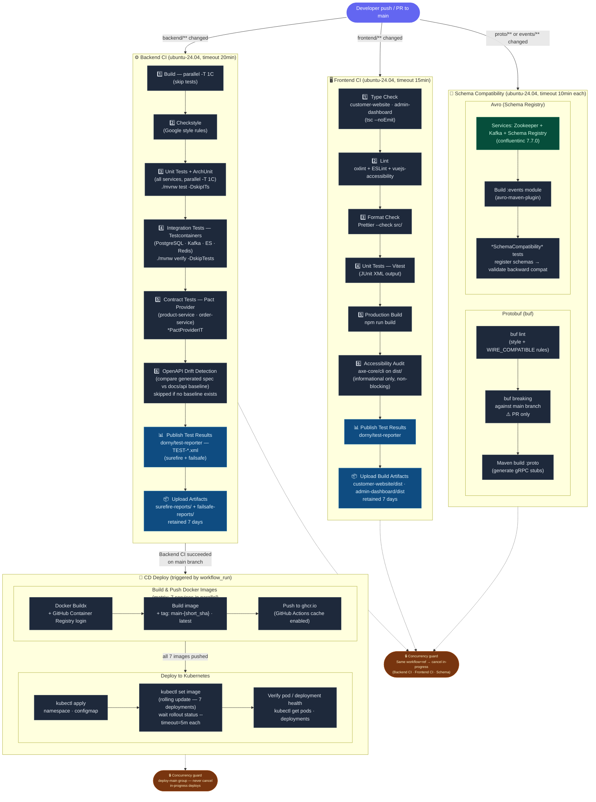

```mermaid
flowchart TD
    %% ─── Triggers ───────────────────────────────────────────────────────────
    DEV([Developer push / PR to main])

    DEV -->|"backend/** changed"| BCI
    DEV -->|"frontend/** changed"| FCI
    DEV -->|"proto/** or events/** changed"| SCI

    %% ─── Backend CI ─────────────────────────────────────────────────────────
    subgraph BCI["⚙️  Backend CI  (ubuntu-24.04, timeout 20min)"]
        direction TB
        B1["1️⃣  Build — parallel -T 1C\n(skip tests)"]
        B2["2️⃣  Checkstyle\n(Google style rules)"]
        B3["3️⃣  Unit Tests + ArchUnit\n(all services, parallel -T 1C)\n./mvnw test -DskipITs"]
        B4["4️⃣  Integration Tests — Testcontainers\n(PostgreSQL · Kafka · ES · Redis)\n./mvnw verify -DskipTests"]
        B5["5️⃣  Contract Tests — Pact Provider\n(product-service · order-service)\n*PactProviderIT"]
        B6["6️⃣  OpenAPI Drift Detection\n(compare generated spec vs docs/api baseline)\nskipped if no baseline exists"]
        B7["📊  Publish Test Results\ndorny/test-reporter — TEST-*.xml\n(surefire + failsafe)"]
        B8["📦  Upload Artifacts\nsurefire-reports/ + failsafe-reports/\nretained 7 days"]

        B1 --> B2 --> B3 --> B4 --> B5 --> B6 --> B7
        B7 --> B8
    end

    %% ─── Frontend CI ─────────────────────────────────────────────────────────
    subgraph FCI["🖥️  Frontend CI  (ubuntu-24.04, timeout 15min)"]
        direction TB
        F1["1️⃣  Type Check\ncustomer-website · admin-dashboard\n(tsc --noEmit)"]
        F2["2️⃣  Lint\noxlint + ESLint + vuejs-accessibility"]
        F3["3️⃣  Format Check\nPrettier --check src/"]
        F4["4️⃣  Unit Tests — Vitest\n(JUnit XML output)"]
        F5["5️⃣  Production Build\nnpm run build"]
        F6["6️⃣  Accessibility Audit\naxe-core/cli on dist/\n(informational only, non-blocking)"]
        F7["📊  Publish Test Results\ndorny/test-reporter"]
        F8["📦  Upload Build Artifacts\ncustomer-website/dist · admin-dashboard/dist\nretained 7 days"]

        F1 --> F2 --> F3 --> F4 --> F5 --> F6 --> F7
        F7 --> F8
    end

    %% ─── Schema Compatibility ────────────────────────────────────────────────
    subgraph SCI["🔗  Schema Compatibility  (ubuntu-24.04, timeout 10min each)"]
        direction LR

        subgraph PROTO["Protobuf (buf)"]
            P1["buf lint\n(style + WIRE_COMPATIBLE rules)"]
            P2["buf breaking\nagainst main branch\n⚠️ PR only"]
            P3["Maven build :proto\n(generate gRPC stubs)"]
            P1 --> P2 --> P3
        end

        subgraph AVRO["Avro (Schema Registry)"]
            A_SVC["Services: Zookeeper + Kafka + Schema Registry\n(confluentinc 7.7.0)"]
            A1["Build :events module\n(avro-maven-plugin)"]
            A2["*SchemaCompatibility* tests\nregister schemas → validate backward compat"]
            A_SVC --> A1 --> A2
        end
    end

    %% ─── CD Deploy ───────────────────────────────────────────────────────────
    BCI -->|"Backend CI succeeded\non main branch"| CD

    subgraph CD["🚀  CD Deploy  (triggered by workflow_run)"]
        direction TB

        subgraph MATRIX["Build & Push Docker Images\n(matrix: 7 services in parallel)"]
            D1["Docker Buildx\n+ GitHub Container Registry login"]
            D2["Build image\n+ tag: main-{short_sha} · latest"]
            D3["Push to ghcr.io\n(GitHub Actions cache enabled)"]
            D1 --> D2 --> D3
        end

        MATRIX -->|"all 7 images pushed"| K8S

        subgraph K8S["Deploy to Kubernetes"]
            K1["kubectl apply\nnamespace · configmap"]
            K2["kubectl set image\n(rolling update — 7 deployments)\nwait rollout status --timeout=5m each"]
            K3["Verify pod / deployment health\nkubectl get pods · deployments"]
            K1 --> K2 --> K3
        end
    end

    %% ─── Concurrency guards ──────────────────────────────────────────────────
    NOTE1(["🔒 Concurrency guard\nSame workflow+ref → cancel in-progress\n(Backend CI · Frontend CI · Schema)"])
    NOTE2(["🔒 Concurrency guard\ndeploy-main group — never cancel\nin-progress deploys"])

    BCI -.-> NOTE1
    FCI -.-> NOTE1
    SCI -.-> NOTE1
    CD -.-> NOTE2

    %% ─── Styles ──────────────────────────────────────────────────────────────
    classDef trigger fill:#6366f1,color:#fff,stroke:none
    classDef step fill:#1e293b,color:#e2e8f0,stroke:#334155
    classDef artifact fill:#0f4c81,color:#e0f2fe,stroke:#1e6fa8
    classDef note fill:#78350f,color:#fef3c7,stroke:#92400e,font-size:11px
    classDef services fill:#064e3b,color:#d1fae5,stroke:#065f46

    class DEV trigger
    class B1,B2,B3,B4,B5,B6,F1,F2,F3,F4,F5,F6,P1,P2,P3,A1,A2,D1,D2,D3,K1,K2,K3 step
    class B7,B8,F7,F8 artifact
    class NOTE1,NOTE2 note
    class A_SVC services
```
